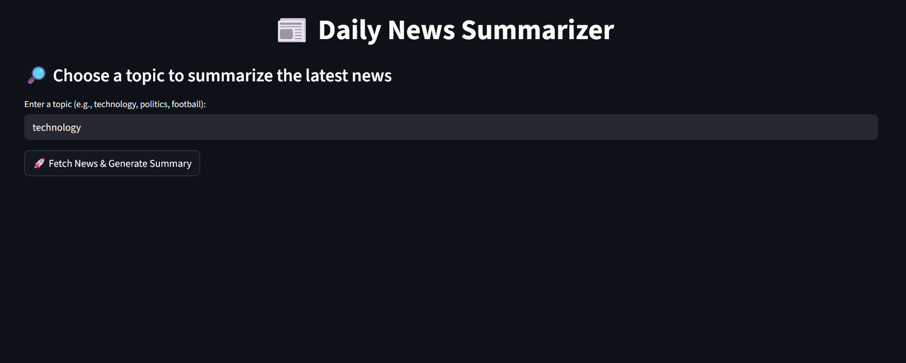

# 📰 Daily News Summarizer

A Streamlit-powered web application that fetches the latest news on a chosen topic, summarizes it using a local LLM (via Ollama), and provides both article previews and downloadable PDF summaries.

---

## 🚀 Features

- 🔎 Search and summarize news on any topic (e.g., technology, politics, sports)
- 🤖 Generate a concise daily summary using a local LLM (Mistral via Ollama)
- 📄 View paginated article results with summaries and links
- 💾 Export PDF summaries of current page or full article list
- 📥 Download structured, clean, and readable daily reports
---
## 📸 Screenshot




---
## 🧠 How It Works

1. **News Fetching**  
   Uses the [NewsAPI](https://newsapi.org/) to fetch recent articles on a selected topic.

2. **Summarization**  
   - Generates a concise summary of the top 20 article descriptions using the `ollama` CLI with a local model (default: `mistral`).
   - Generates paginated article results with summaries and links

4. **PDF Generation**  
   Generates downloadable reports using `FPDF`, including:
   - Date and topic
   - Generated summary
   - A list of articles with links

---
## 📂 Project Structure

```
.
├── news.py                # Main Streamlit app
├── requirements.txt      # Required Python packages
└── README.md             # You're here!
```
---

## 🖥️ Setup Instructions

### 1. Clone the Repository

```bash
git clone https://github.com/Adamderbel/daily-news-summarizer.git
cd daily-news-summarizer
```

### 2. Install Dependencies
```bash
python -m venv venv
source venv/bin/activate  # On Windows: venv\Scripts\activate
pip install -r requirements.txt
```

### 3. Set Up Ollama

1. Install [Ollama](https://ollama.com/download) (supports Linux, macOS, Windows).
2. Start the Ollama server:

   ```bash
   ollama serve
   ```
3. Pull the Mistral model (or another supported model):

   ```bash
   ollama pull mistral
   ```

### 4. Configure NewsAPI Key

Open **`news.py`** and replace the placeholder with your own API key:

```python
NEWS_API_KEY = "your_news_api_key_here"
```

> Get your API key from [https://newsapi.org](https://newsapi.org)

### 5. Run the App

```bash
streamlit run news.py
```

---


## 💻 System Requirements
- Python 3.8+
- 4GB+ RAM (8GB recommended for FAISS and Ollama)
- Ollama server (Linux, macOS, or Windows)
- Internet connection for scraping and model downloads
---

## 🙌 Acknowledgements

* [Streamlit](https://streamlit.io)
* [NewsAPI](https://newsapi.org)
* [Ollama](https://ollama.com)
* [FPDF](https://pyfpdf.readthedocs.io/)
